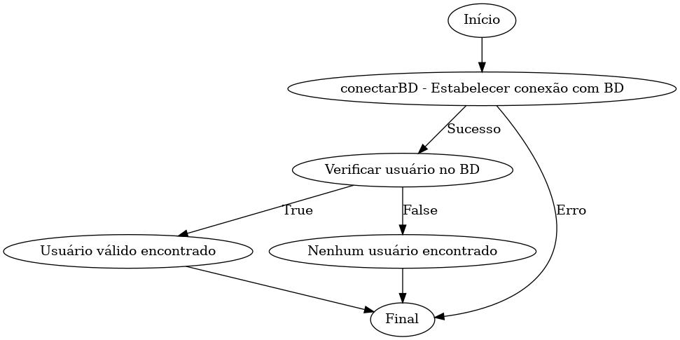

# Análise do Código - Teste de Caixa Branca

---

## Erros Identificados

### 1. Uso de String para Construção de Queries (SQL Injection)
- O uso de concatenação de strings para montar queries SQL torna o código vulnerável a ataques de SQL Injection.

### 2. Manuseio de Conexões com o Banco de Dados
- As conexões com o banco de dados, `Statement` e `ResultSet` não são fechados adequadamente, o que pode causar vazamento de recursos.

### 3. Uso Obsoleto de `Class.forName`
- A linha que carrega o driver do banco de dados é desnecessária em versões modernas do JDBC (4.0 ou superior).

### 4. Exposição de Credenciais no Código
- As credenciais do banco de dados estão hardcoded no código.

### 5. Falta de Validação de Entrada
- Os parâmetros fornecidos pelo usuário (`login` e `senha`) não são validados ou sanitizados antes do uso.

---

## 📊 Grafo de Fluxo

---

## 📈 Complexidade Ciclômica

A **complexidade ciclômica** do código é calculada com a fórmula:

\[ M = E - N + 2 \]

Onde:  
- \( E \): Número de arestas (7).  
- \( N \): Número de nós (6).  

**Cálculo:**  
\[ M = 7 - 6 + 2 = 3 \]  

A complexidade ciclômica do método é **3**, indicando que existem **3 caminhos independentes**.

---

## 🔄 Sequência de Caminhos Independentes

1. **Caminho 1**:  
   Início → conectarBD → Verificar usuário → Credenciais válidas → Usuário encontrado → Final.

2. **Caminho 2**:  
   Início → conectarBD → Verificar usuário → Credenciais inválidas → Nenhum usuário encontrado → Final.

3. **Caminho 3**:  
   Início → conectarBD falhou → Final.

---
